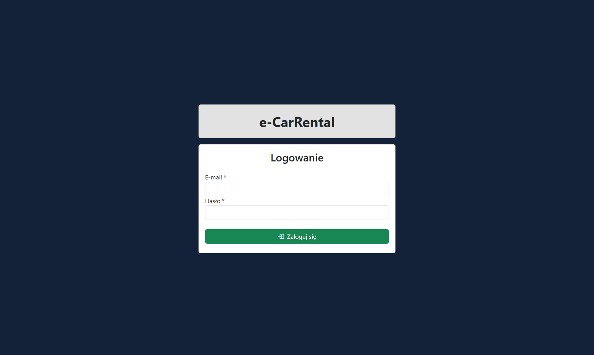

# e-CarRental

## About project
The project is a web application designed for managing a car rental service. Its main goal is to enable efficient management of cars, rentals, customers, employees and payments. The system allows users to track rental statuses in real time, monitor car availability, and manage account settings. The application supports both Polish and English languages, providing accessibility for a wider group of users. It improves daily workflow for employees and helps administrators make strategic decisions through an intuitive and centralized system.

## Technologies
### Frontend
- Framework:
    - Angular
- Languages:
    - TypeScript
    - HTML
    - CSS
- Key Features:
    - Polish and English translation
    - Toastr notifications
    - Bar charts
    - JWT in cookies
- Application styling:
    - Bootstrap

### Backend
- Framework:
    - ASP.NET Core Web API
- Language:
    - C#
- Key Features:
    - Dependency Injection, DTO, Controller, Repository patterns
    - Authentication and authorization
    - JWT
    - LINQ
    - Application's seeder during the initial launch
    - Mapping profiles
- ORM:
    - Entity Framework Core
        - Migrations

### Database system
- Microsoft SQL Server

## Roles in the application
- Admin
- Employee
- Visitor

### Database schema

## Main functions
- **Admin**:
    - Rentals management
    - Cars management
    - Clients management
    - Employees management
    - Payments management
    - Account settings management
- **Employee**:
    - Rentals management
    - Cars management
    - Clients management
    - Adding payments
    - Account settings management
- **Visitor**:
    - Logging into the system

## Application presentation
Login panel:

Dashboard:

List of rentals:

Car creation form:

Car details:

Account settings:

